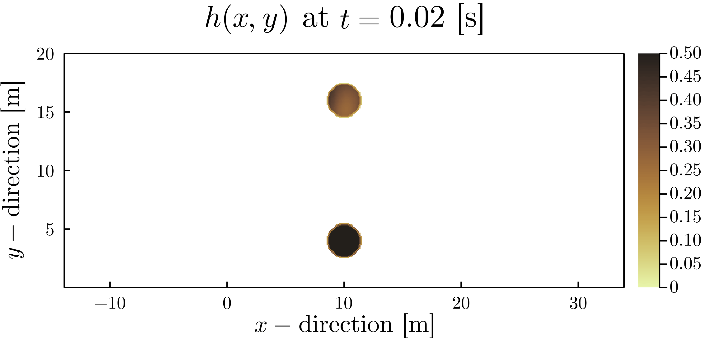

# ***saintVenant*** #
## **Description** 
This is a small Julia project undertaken during an temporary position held at the "Centre de recherche sur l'environnement alpin" (CREALP, see https://crealp.ch). This small research project aims at solving conservative two-dimensional flow problems considering the following: 
 - the non-linear hyperbolic system of Saint-Venant equations under:
     - a finite volume method framework 
     - considering a Godunov-type first order solver, i.e., HLL/HLLC approximate Riemann solver.
     - with a well-balanced approach, i.e., the hydrostatic reconstruction

This resulted in a Julia project, made publicly available on a Github repository. 

<p align="center">
  
</p>

* **Fig |** Dynamics through time $t$ of the height $h(x,y)$ in [m] for a Coulomb-type geomaterial flowing down an irregular bowl-like topography with a frictional basal resistance law, i.e., $\boldsymbol{\tau} = \rho g h \tan \phi \hat{\boldsymbol{u}}$, where $\hat{\boldsymbol{u}} = (u/||\boldsymbol{v}||_2,v/||\boldsymbol{v}||_2)^T$

<p align="center">
  
</p>

* **Fig |** Dynamics through time $t$ of the height $h(x,y)$ in [m] for a Newtonian-type material (e.g., water) flowing down an irregular bowl-like topography with a frictional basal resistance law, i.e., $\boldsymbol{\tau} = \boldsymbol{0}$

## **Content**
1. [Theory](#id-section1)
2. [Usage](#id-section2)
3. [References](#id-section3)

<div id='id-section1'/> 

## **Theory**
The finite volume method (FVM) is used to solve the non-linear hyperbolic system of Saint-Venant equations. A regular cartesian mesh is used and Godunov-type method is used to approximate numerical fluxes at the inter-cell locations. To solve for local Riemann problems, a HLL- or HLLC-type approximate Riemann solver is used. The general idea is described in the following. 

### **HLL flux**
An approximate Riemann solver was proposed by Harten, Lax and van Leer in 1983 and was coined HLL10 solver (Harten et al. 1983) and it requires estimates for the fastest signal velocities emerging at the local Riemann problem, i.e., the discontinuity. This resulted in a two-wave model. A more accurate method is the HLLC solver, proposed by Toro and co-workers in 1992, see Toro 2001; Toro 2019. It considers a three-wave model and better resolve intermediate waves at the discontinuity.

Formally, the approximate numerical flux is given by the following (Toro 2001; Huang et al. 2013; Toro 2013; Toro 2019):

$$
	\begin{align}
		\mathbf{F}_{i+\frac{1}{2}}=
		\begin{cases}
			\mathbf{F}_{L} & \text{if}\quad s_L \geq 0, \\
			\mathbf{F}^{\mathrm{hll}}=\frac{ s_R\mathbf{F}_{L}-s_L\mathbf{F}_{R}+s_Rs_L(\mathbf{U}_{R}-\mathbf{U}_{L}) }{s_R-s_L}& \text{if} \quad s_L \leq 0 \leq s_R,\\
			\mathbf{F}_{R}& \text{if}\quad s_R \leq 0,
		\end{cases} 
	\end{align}
$$

where a reliable estimate for the wave speeds $s_{L,R}$ at the discontinuity (considering wet-dry transition) is needed, i.e., 

$$
\begin{align}
		s_L=
\begin{cases}
u_R - 2a_R & \text{if}\quad h_L = 0, \\
\min(u_L - a_L,u_{\star} - a_{\star}) & \text{if}\quad h_L > 0, \\
\end{cases} 
\end{align} 
$$

and,

$$
	\begin{align}
	s_R=
	\begin{cases}
		u_L + 2a_L & \text{if}\quad h_R = 0, \\
		\max(u_R +a_R, u_{\star} - a_{\star}) & \text{if}\quad h_R > 0, \\
	\end{cases} 
\end{align} 
$$

where

$$
\begin{align}
	h_{\star}&=\frac{1}{g}\left(\frac{1}{2}(a_L+a_R)+\frac{1}{4}(u_L-u_R)\right)^2, \\
	u_{\star}&=\frac{1}{2}(u_L+u_R)+(a_L-a_R),\\
	a_{L,R,\star}&=\sqrt{g h_{L,R,\star}}.
\end{align}
$$

### **Rusanov and Lax-Friedrich fluxes**
Another estimate for wave speed velocities is the following:

$$
	\begin{align}
		s_L = -s^{+} \quad \text{,} \quad s_R = s^{+},
	\end{align}
$$

where the estimate $s^{+}=\max(|u_L|+a_L,|u_R|+a_R)$. If $s_{L,R}$ are substituted in \ref{hll_fluxes} following this maximum wave speed estimate, one obtain the Rusanov flux, i.e., 

$$
	\begin{align}
		\mathbf{F}_{i\pm\frac{1}{2}}^{\mathrm{Rus}}= \frac{1}{2}(\mathbf{F}_{L}+\mathbf{F}_{R}) - \frac{1}{2}s^{+}(\mathbf{U}_{R}-\mathbf{U}_{L}).
	\end{align}
$$

If one selects $s^{+}=\frac{\Delta x}{\Delta t}$, this results in the Lax-Friedrich flux

$$
  \begin{align}
	\mathbf{F}_{i\pm\frac{1}{2}}^{\mathrm{LF}}= \frac{1}{2}(\mathbf{F}_{L}+\mathbf{F}_{R}) - \frac{\Delta x}{2\Delta t}(\mathbf{U}_{R}-\mathbf{U}_{L}).
	\end{align}
$$

<div id='id-section2'/> 

## **Usage**

### Structure of the project
The general structure is given below:
```terminal
├── Manifest.toml
├── Project.toml
├── README.md
├── docs
│   ├── example
│   ├── refs
│   └── tex
├── scripts
│   ├── basin.jl
│   ├── coast.jl
│   ├── geoflow.jl
│   ├── runoff.jl
│   ├── readDEM.jl
│   └── run.sh
├── src
│   ├── fun
│   ├── run.sh
│   └── saintVenant.jl
├── viz
└── start_macOS.sh
```

The ```./src/fun``` folder contains all functions needed and are called by the different routines in ```./scripts```.

The ```./viz/out``` folder contains all the plots and data generated by the solver during computation and it is automatically generated by the routine

If needed, modifications can be made to these routines by changing initial parameters and so on. 

### Run the routine ```geoflow.jl``` 

0. (opt.) Get Julia [here](https://julialang.org/downloads/) and follow instructions
1. Clone the repository
```terminal
git clone https://github.com/ewyser/saintVenant
```
2. Navigate to ``` ./saintVenant ``` 
3. Launch Julia (on macOS, drag & drop ```start_macOS.sh``` in the terminal without navigating in terminal)
```julia
% julia --project  
               _
   _       _ _(_)_     |  Documentation: https://docs.julialang.org
  (_)     | (_) (_)    |
   _ _   _| |_  __ _   |  Type "?" for help, "]?" for Pkg help.
  | | | | | | |/ _` |  |
  | | |_| | | | (_| |  |  Version 1.6.5 (2021-12-19)
 _/ |\__'_|_|_|\__'_|  |  Official https://julialang.org/ release
|__/                   |

```
4. Enter pkg mode ``` ] ``` and instantiate the environment
```julia
(saintVenant) pkg> activate .
(saintVenant) pkg> instantiate 
(saintVenant) pkg> st
     Project saintVenant v0.1.0
      Status `~/Dropbox/Jobs/CREALP/fvm/fvm_nD_code/saintVenant/Project.toml`
  [336ed68f] CSV v0.10.4
  [35d6a980] ColorSchemes v3.19.0
  [28b8d3ca] GR v0.66.0
  [b964fa9f] LaTeXStrings v1.3.0
  [91a5bcdd] Plots v1.31.2
  [92933f4c] ProgressMeter v1.7.2
  [8bb1440f] DelimitedFiles
```
5. Run a script
```julia
julia> include("./scripts/geoflow.jl")
```

6. The outputs (figs, gif, etc.) are saved in the folder ``` ./src/out/ ```

### Play around in ```geoflow.jl```: a quick example
The user can change initial parameter for the simulation, i.e., generate gif, select numerical flux, the rheological model or if precipitation is enable, such as
```julia 
Dsim   = param("HLLC",false,"coulomb",false)
```
with the following declaration prototype for the structure ```Dsim``` located at ```./src/fun/misc.jl```, i.e., 
```julia 
struct param
    solv_type::String
    make_gif::Bool
    flow_type::String
    pcpt_onoff::Bool
end
Dsim = param(solv_type,make_gif,flow_type,pcpt_onoff)
```
The user can select three different flux types, e.g., ```"Rus"```, ```"HLL"``` or ```"HLLC"``` and two different rheological/basal resistance models, e.g., ```"newtonian"``` and ```"coulomb"```. 

<div id='id-section3'/> 

## **References**
For useful references, the reader can have a look in the folder ```./docs/refs```, where some of the following references can be found

1. Castro-Orgaz, O. and W.H. Hager (2019). Shallow Water Hydraulics. Springer International Publishing. isbn: 9783030130732. doi: 10.1007/978-3-030- 13073-2. url: https://link.springer.com/book/10.1007/978-3-030- 13073-2.

2. Hodges, B. R. (2019). “Conservative finite-volume forms of the Saint-Venant equations for hydrology and urban drainage”. In: Hydrology and Earth Sys- tem Sciences 23.3, pp. 1281–1304. doi: 10.5194/hess-23-1281-2019. url: https://hess.copernicus.org/articles/23/1281/2019/.

3. Toro, E. F. (2019). “The HLLC Riemann solver”. In: Shock Waves 29.8, pp. 1065–1082. issn: 1432-2153. doi: 10.1007/s00193-019-00912-4. url: https://doi.org/10.1007/s00193-019-00912-4.

4. Toro, Eleuterio F (2013). Riemann solvers and numerical methods for fluid dynamics: a practical introduction. Springer Science & Business Media. doi: 10.1007/b79761.

5. Guinot, Vincent (2012). Wave propagation in fluids: models and numerical techniques. John Wiley & Sons.

6. Kerger, F. et al. (2011). “An exact Riemann solver and a Godunov scheme for simulating highly transient mixed flows”. In: Journal of Computational and Applied Mathematics 235.8, pp. 2030–2040. issn: 0377-0427. doi: https:// doi.org/10.1016/j.cam.2010.09.026. url: https://www.sciencedirect. com/science/article/pii/S0377042710005558.

7. LeVeque, Randall J. (2002). Finite Volume Methods for Hyperbolic Problems. Cambridge Texts in Applied Mathematics. Cambridge University Press. doi: 10.1017/CBO9780511791253.
Toro, Eleuterio (2001). Shock Capturing Methods for Free Surface Shallow Flows. Wiley and Sons. isbn: 978-0-471-98766-6.

8. Harten, Amiram et al. (1983). “On Upstream Differencing and Godunov-Type Schemes for Hyperbolic Conservation Laws”. In: SIAM Review 25.1, pp. 35– 61. doi: 10.1137/1025002. eprint: https://doi.org/10.1137/1025002. url: https://doi.org/10.1137/1025002.

9. Godunov, Sergei K. and I. Bohachevsky (1959). “Finite difference method for numerical computation of discontinuous solutions of the equations of fluid dynamics”. In: Matematiˇceskij sbornik 47(89).3, pp. 271–306. url: https: //hal.archives-ouvertes.fr/hal-01620642.

10. Huang, Yuxin et al. (2013). “Well-Balanced Finite Volume Scheme for Shallow Water Flooding and Drying Over Arbitrary Topography”. In: Engineering Applications of Computational Fluid Mechanics 7.1, pp. 40–54. doi: 10. 1080/19942060.2013.11015452. eprint: https://doi.org/10.1080/ 19942060.2013.11015452. url: https://doi.org/10.1080/19942060. 2013.11015452.

11. Toro, Eleuterio (2001). Shock Capturing Methods for Free Surface Shallow Flows. Wiley and Sons. isbn: 978-0-471-98766-6.

## **Helper: create a project environment**
In Julia, enter package mode, i.e., ``` ] ```, and type the following commands to generate and activate a new project:
```julia
(@v1.6) pkg> generate <NameOfProject>
(@v1.6) pkg> activate <NameOfProject>
(<NameOfProject>) pkg> add CSV, DelimitedFiles
(<NameOfProject>) pkg> update
```
To check the status of the project, in package mode, enter ``` (<NameOfProject>) pkg> st ```, which gives
```julia
(<NameOfProject>) pkg> st
     Project <NameOfProject> v0.1.1
      Status `~/<NameOfProject>/Project.toml`
  [336ed68f] CSV v0.10.4
  [8bb1440f] DelimitedFiles
(<NameOfProject>) pkg> 
```